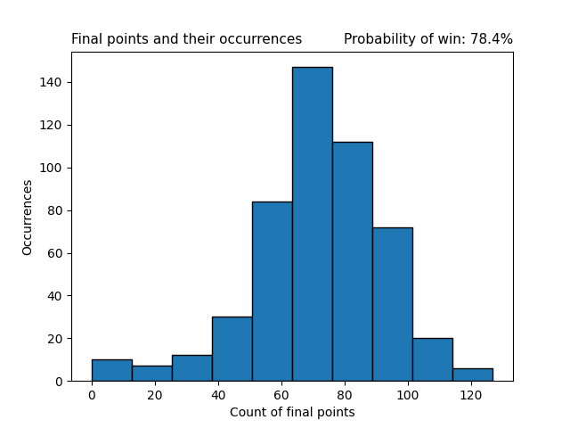

# Case study - dice game probability
This case study analyze the probability of winning a die game.

There were NumPy random numbers used with the seed 123.
All the results are based on this seeds pseudo random numbers.

### Rules of the game
A person begins with 0 points and his goal is to be able to 60 points within 100 die throws.\
Rules fo each side of the dice:
* **1, 2 -** user **loses one point** from his overall score (cannot go lower than 0)
* **3, 4, 5 -** user **gains one point** to his overall score
* **6 -** user gains as many points as his next throws number worth (if next throws number is 4 he gains 4 points)

There is **0.1% chance** in each throw to _"loose all points"_ and return back to overall score 0

### Case study
In this case study the game **is played  500 times.**\
Result of this case study is histogram of the most repeated final overall scores (Figure 1).
Second result of the case study is probability of succeeding in the game in percentage.

### Results of the case study
\
Figure 1: Final points and their occurrences histogram.
